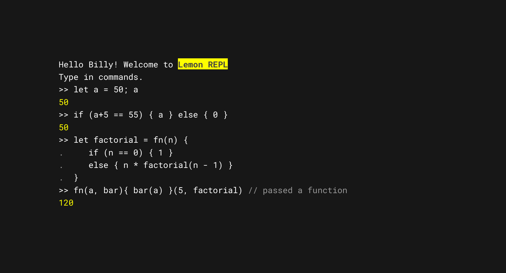

# The Lemon Programming Language

Lemon is a tiny, fast, interpreted language. This repository contains the source code for the Lemon interpreter, written in Go. The language is still in development, and the interpreter is not yet feature-complete. A peek at the REPL atm:



## Syntax

TODO BNF

## Features

- [x] Data types: boolean, integer
- [x] Variables
- [x] Arithmetic operations
- [x] Logical operations
- [x] Functions
- [x] Comparison operations
- [ ] Control structures
  - [x] if, else
  - [ ] else if branch
  - [ ] switch, case
  - [ ] match, when
  - [ ] while, for, loop
  - [ ] break, continue
- [x] Garbage collection
- [x] Strings
- [ ] String concatenation
- [ ] Comments
- [ ] Error handling
- [ ] Arrays
- [ ] Standard library
- [ ] Modules
- [ ] Classes
- [ ] Generics
- [ ] Multithreading

## Usage

To run the REPL, use the following command:

```bash
go run main.go
```

To build the interpreter, use the following command:

```bash
go build
```

Running [lemon files](./example.mm) (after building):

```bash
lemon example.mm
```

To run tests, use the following command:

```bash
go test <directory>
```
